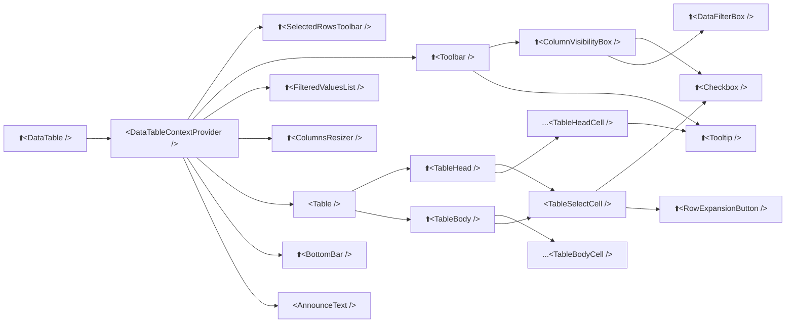

# Anatomy

The `<DataTable />` component in the MUI DataTable Delight library is structured hierarchically, comprising several interconnected sub-components. Understanding this hierarchy is essential for effective customization and utilization. Below is an overview of each sub-component based on the provided structure:

## `<DataTable />`

The `<DataTable />` serves as the primary component that users interact with. It acts as a wrapper, encapsulating all other sub-components to present a cohesive data table interface.

## `<DataTableContextProvider />`

The `<DataTableContextProvider />` manages the state and context for the `<DataTable />`. It ensures that all sub-components have access to necessary data and configurations, facilitating seamless communication and state management within the table.

## `<SelectedRowsToolbar />`

The `<SelectedRowsToolbar />` appears when one or more rows are selected. It provides tools and actions pertinent to the selected rows, such as delete or export options, enhancing user interaction with specific data subsets.

## `<Toolbar />`

The `<Toolbar />` is positioned at the top of the table, offering interactive elements like search fields, filter options, and buttons for exporting data. This component enhances user interaction and data manipulation capabilities.

## `<ColumnVisibilityBox />`

Nested within the `<Toolbar />`, the `<ColumnVisibilityBox />` allows users to toggle the visibility of specific columns. It contains `<Checkbox />` components corresponding to each column, enabling a customized view of the data table.

## `<DataFilterBox />`

Also within the `<Toolbar />`, the `<DataFilterBox />` provides filtering options to refine the displayed data. It works in conjunction with the `ColumnVisibilityBox` to offer a tailored data viewing experience.

## `<Tooltip />`

The `<Tooltip />` component offers additional information upon hovering over certain elements. Within the `<Toolbar />`, it provides guidance or details about specific controls, enhancing usability.

## `<RowExpansionButton />`

The `<RowExpansionButton />` is associated with rows that can be expanded to reveal more detailed information. It enhances the table's interactivity by allowing users to view nested data without navigating away from the current view.

## `<FilteredValuesList />`

The `<FilteredValuesList />` displays the list of active filters applied to the data. It enables users to easily view and modify current filters, ensuring transparency and control over the data presentation.

## `<ColumnsResizer />`

The `<ColumnsResizer />` allows users to adjust the width of columns dynamically. This component enhances the table's flexibility, accommodating various data presentation needs and improving readability.

## `<Table />`

The `<Table />` component is the core structure that houses the data. It contains two primary sub-components:

- **TableHead**: Represented by `<TableHead />`, it contains the column headers, providing context for the data presented. It often includes features like sorting indicators, enabling users to sort data by specific columns.

- **TableBody**: Denoted as `<TableBody />`, it houses the main data rows, with each row corresponding to a data entry. Individual cells are aligned under the appropriate column headers, ensuring clarity and organization.

## `<TableSelectCell />`

The `<TableSelectCell />` is involved in row selection, containing `<Checkbox />` components that allow users to select individual rows. It also integrates the `RowExpansionButton` for expandable rows, enhancing interactivity.

## `<TableHeadCell />`

Represented as `<TableHeadCell />`, these cells make up the `TableHead`. Each cell corresponds to a column and may include a `Tooltip` to provide additional information about the column, aiding user understanding.

## `<TableBodyCell />`

Denoted as `<TableBodyCell />`, these cells constitute the `TableBody`. Each cell contains data corresponding to its respective column and row, forming the main content of the table.

## `<BottomBar />`

The `<BottomBar />` component is located at the bottom of the table, typically housing pagination controls and summary information. It facilitates navigation through large datasets and provides users with additional context or controls related to the data presented.

## `<AnnounceText />`

The `<AnnounceText />` component is used for accessibility purposes, providing screen readers with updates about changes in the table's state, such as filter applications or data loading statuses. This ensures that the table is usable by individuals relying on assistive technologies.

Understanding the roles and interactions of these sub-components is crucial for effectively utilizing and customizing the `<DataTable />` component to meet specific application needs. 